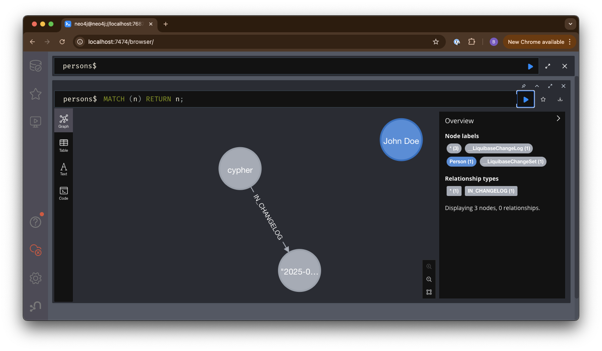

# Liquibase dozerDB transaction issue

## Description

This project is a simple example of how to reproduce the issue with Liquibase and DozerDB.

## Steps to reproduce

1. Clone the repository

2. Run the following command:

```bash
docker compose down && docker compose up liquibase-dozerdb
```

This will fail with the following error:

```log
Unexpected error running Liquibase: Unable to complete transaction.

liquibase.exception.CommandExecutionException: org.neo4j.driver.exceptions.DatabaseException: Unable to complete transaction.
   at liquibase.command.CommandScope.lambda$execute$6(CommandScope.java:300)
   at liquibase.Scope.child(Scope.java:210)
   at liquibase.Scope.child(Scope.java:186)
   at liquibase.command.CommandScope.execute(CommandScope.java:241)
   at liquibase.integration.commandline.CommandRunner.call(CommandRunner.java:51)
   at liquibase.integration.commandline.CommandRunner.call(CommandRunner.java:21)
   at picocli.CommandLine.executeUserObject(CommandLine.java:2045)
   at picocli.CommandLine.access$1500(CommandLine.java:148)
   at picocli.CommandLine$RunLast.executeUserObjectOfLastSubcommandWithSameParent(CommandLine.java:2465)
   at picocli.CommandLine$RunLast.handle(CommandLine.java:2457)
   at picocli.CommandLine$RunLast.handle(CommandLine.java:2419)
   at picocli.CommandLine$AbstractParseResultHandler.execute(CommandLine.java:2277)
   at picocli.CommandLine$RunLast.execute(CommandLine.java:2421)
   at picocli.CommandLine.execute(CommandLine.java:2174)
   at liquibase.integration.commandline.LiquibaseCommandLine.lambda$execute$2(LiquibaseCommandLine.java:414)
   at liquibase.Scope.child(Scope.java:210)
   at liquibase.Scope.child(Scope.java:186)
   at liquibase.integration.commandline.LiquibaseCommandLine.lambda$execute$3(LiquibaseCommandLine.java:389)
   at liquibase.Scope.child(Scope.java:210)
   at liquibase.Scope.child(Scope.java:186)
   at liquibase.integration.commandline.LiquibaseCommandLine.execute(LiquibaseCommandLine.java:386)
   at liquibase.integration.commandline.LiquibaseCommandLine.main(LiquibaseCommandLine.java:103)
   at java.base/jdk.internal.reflect.NativeMethodAccessorImpl.invoke0(Native Method)
   at java.base/jdk.internal.reflect.NativeMethodAccessorImpl.invoke(Unknown Source)
   at java.base/jdk.internal.reflect.DelegatingMethodAccessorImpl.invoke(Unknown Source)
   at java.base/java.lang.reflect.Method.invoke(Unknown Source)
   at liquibase.integration.commandline.LiquibaseLauncher.main(LiquibaseLauncher.java:121)
```

## Expected behavior

Run the Neo4J Enterprise equivalent using the following command:

```bash
docker compose down && docker compose up liquibase-neo4j
```

This will run successfully and result in the following:


